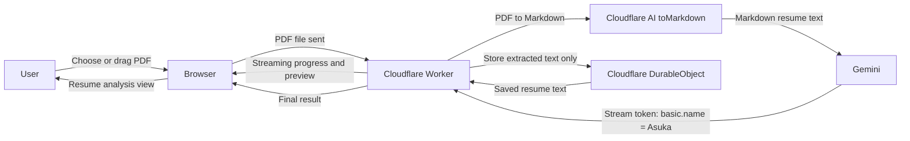

# Resume Analyze

Cloudflare Worker fullstack app for uploading PDF resumes, extracting structured
resume data with Workers AI and Cloudflare AI Gateway, storing resume/JD records
in Durable Objects, and serving a React UI from Worker static assets.

## Stack

- Frontend: React, React Router v7, XState, SWR, ArkType, StyleX, Tailwind CSS,
  daisyUI.
- Backend: Express on Cloudflare Workers with `nodejs_compat`.
- Cloudflare: Durable Objects, Workers AI, AI Gateway, Worker static assets.
- Quality: Vitest API and browser tests, Playwright e2e entrypoint, Oxlint,
  Prettier.

## Project Arch



### Frontend

- Stack: React, React Router v7, XState, SWR, ArkType, Tailwind CSS, daisyUI
- Choosing React with XState is easy, FP with state machine is one classic and mature chooice, using daisyUI cause is beauty, for ArkType, its lightweight and performed well than Zod and others; for the SWR, Vercel real create some thing interesting. Why not Next.JS? Most of the stuff isn't that easy to be configured SSR or Hybrid, so, using manually React would be good to start the MVP.

### API

- Stack: Express running inside Cloudflare Workers with `nodejs_compat`
- Choosing Cloudflare Worker to host both the frontend and API layers is convenient and reliable.

### Storage

- Stack: SQLite-backed Durable Objects for resume registry, resume documents,
  and JD records
- Choosing the Durable Object is a good way for the resume the streaming data and edit states, as it can handle the stateful nature of the resume analysis process, and, it is cross worker shared.

### Async Jobs

- Stack: Cloudflare Queues for background resume analysis retries
- Choosing Worker, so, choosing the Queue for job that may long and needs retry is fast.

### LLM Interaction

- Stack: Workers AI `toMarkdown`, AI Gateway, Google AI Studio Gemini streaming,
  custom stream-token parsing algorithm
- Choosing custom stream token cause we wanted first token is as fast as enough, though the toMarkdown will slow it down, but, the content extraction isn't that slow, and, the design of customize token parsing providing much abstractions, and, able to handle the streaming nature of the model output.

### Validation and Tests

- Stack: ArkType schemas, Vitest integration/browser/Workers tests, Playwright
  e2e entrypoint, Oxlint, Prettier
- For the test, we don't write the Unit test or any test that needs to check the internal data state, cause, backend needs scale, you can't assume it's arch or layout or layer won't changed much, so, how user use it is the stable and easy to mantain test. And, using Arktype with it is easy.

## Streaming Resume Shape

Resume extraction does not ask the model to stream one giant JSON object. The
prompt asks Gemini to emit independent XML-style field tags such as
`<basic.name>Asuka</basic.name>` and
`<project.0.name>Resume Analyzer</project.0.name>`. Each tag is a flat field
path plus a value.

`src/shared/resumeStream.ts` is the core abstraction:

- `ResumeFieldTagParser` reads model text chunk by chunk and only emits a token
  after a complete matching tag arrives, even when the tag crosses stream
  boundaries.
- `createResumeFieldToken` turns a path into a nested patch. For example,
  `edu.1.school` becomes `{ edu: [undefined, { school: "..." }] }`.
- `mergeResumeTokenPatch` and `collectResumeFieldTokens` make token order
  independent, while numeric path segments rebuild sparse arrays.
- `resumeFromTokenPatch` compacts the patch and returns the final nested
  `ResumeAnalysis` object that the UI and storage layer expect.

The backend streams Server-Sent Events from
`/api/resumes/analyze/stream`: `status` events drive progress UI, `token` events
carry `path`, `value`, and `patch` for incremental reconstruction, and the
`complete` event carries the persisted `resumeId` plus the normalized nested
resume. The current frontend preview displays the streamed path/value tokens,
then routes to the detail page after completion; because the token patch format
is shared, the same stream can also reconstruct the final nested resume object
incrementally on the client.

## Commands

```sh
pnpm install
pnpm run cf-typegen
pnpm run lint
pnpm run typecheck
pnpm run test
pnpm run test:real-ai
pnpm run build
pnpm run dev:local
```

`pnpm run test:real-ai` runs the real PDF extraction test through the Cloudflare
Workers Vitest pool with remote bindings enabled. It downloads
`https://skyzh.github.io/files/cv.pdf`, posts it to the Worker API, waits for
the async resume analysis job, validates the JSON with ArkType, and checks that
the extracted content matches the CV. It requires Cloudflare credentials for
remote bindings. `pnpm run test:e2e` runs the deployed-app Playwright test. It
is skipped unless `E2E_BASE_URL` is set.

`pnpm run dev:local` starts a simulated local app with Vite, Express, and the
in-memory test service implementations. `pnpm run dev` runs Wrangler and uses
the real Cloudflare bindings; with the Workers AI binding, Wrangler requires
Cloudflare credentials for the remote dev session.

## Cloudflare Setup

The Durable Object classes, Queues, Workers AI binding, and non-secret AI
Gateway settings are already declared in `wrangler.jsonc`. Resume extraction
uses the `collects-auto-ai` gateway with Google AI Studio BYOK configured in
Cloudflare, so the app does not need a local `CF_AIG_TOKEN`. The GitHub Actions
PR checks and deploy workflow expect `CLOUDFLARE_ACCOUNT_ID` and
`CLOUDFLARE_API_TOKEN` secrets. The token must be able to run the Worker with
remote bindings and use the configured AI resources.
