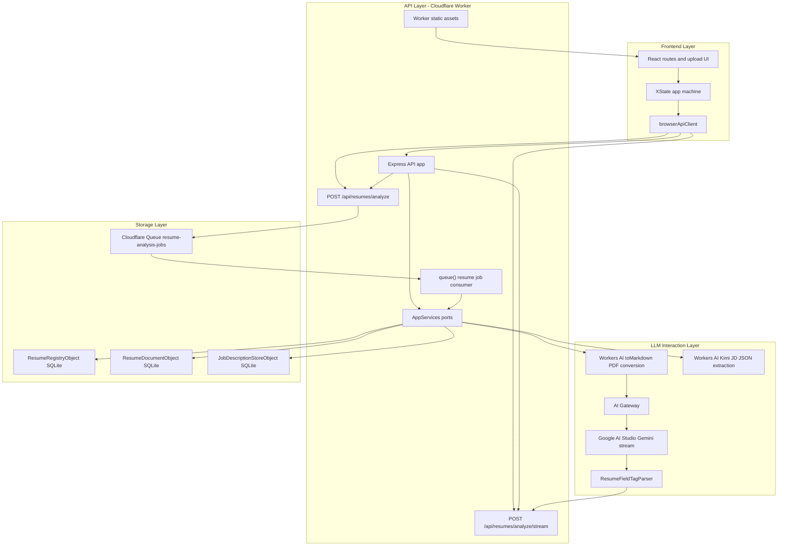

# Resume Analyze

Cloudflare Worker fullstack app for uploading PDF resumes, extracting structured
resume data with Workers AI and Cloudflare AI Gateway, storing resume/JD records
in Durable Objects, and serving a React UI from Worker static assets.

## Stack

- Frontend: React, React Router v7, XState, SWR, ArkType, StyleX, Tailwind CSS,
  daisyUI.
- Backend: Express on Cloudflare Workers with `nodejs_compat`.
- Cloudflare: Durable Objects, Workers AI, AI Gateway, Worker static assets.
- Quality: Vitest API and browser tests, Playwright e2e entrypoint, Oxlint,
  Prettier.

## Project Arch



The Worker is the public boundary for both the static React application and the
API. API handlers depend on `AppServices` ports, so the Cloudflare deployment
uses Durable Objects, Queues, Workers AI, and AI Gateway while local and test
runtimes can swap in memory-backed implementations.

## Tech Stack Peek Reason

Fill in the Reason column with the wording you want to present.

| Area                 | Tech Stack Peek                                                                                         | Reason |
| -------------------- | ------------------------------------------------------------------------------------------------------- | ------ |
| Frontend             | React, React Router v7, XState, SWR, ArkType, Tailwind CSS, daisyUI                                     |        |
| API                  | Express running inside Cloudflare Workers with `nodejs_compat`                                          |        |
| Storage              | SQLite-backed Durable Objects for resume registry, resume documents, and JD records                     |        |
| Async Jobs           | Cloudflare Queues for background resume analysis retries                                                |        |
| LLM Interaction      | Workers AI `toMarkdown`, AI Gateway, Google AI Studio Gemini streaming, Workers AI Kimi JSON extraction |        |
| Validation and Tests | ArkType schemas, Vitest integration/browser/Workers tests, Playwright e2e entrypoint, Oxlint, Prettier  |        |

## Streaming Resume Shape

Resume extraction does not ask the model to stream one giant JSON object. The
prompt asks Gemini to emit independent XML-style field tags such as
`<basic.name>Ava Chen</basic.name>` and
`<project.0.name>Resume Analyzer</project.0.name>`. Each tag is a flat field
path plus a value.

`src/shared/resumeStream.ts` is the core abstraction:

- `ResumeFieldTagParser` reads model text chunk by chunk and only emits a token
  after a complete matching tag arrives, even when the tag crosses stream
  boundaries.
- `createResumeFieldToken` turns a path into a nested patch. For example,
  `edu.1.school` becomes `{ edu: [undefined, { school: "..." }] }`.
- `mergeResumeTokenPatch` and `collectResumeFieldTokens` make token order
  independent, while numeric path segments rebuild sparse arrays.
- `resumeFromTokenPatch` compacts the patch and returns the final nested
  `ResumeAnalysis` object that the UI and storage layer expect.

The backend streams Server-Sent Events from
`/api/resumes/analyze/stream`: `status` events drive progress UI, `token` events
carry `path`, `value`, and `patch` for incremental reconstruction, and the
`complete` event carries the persisted `resumeId` plus the normalized nested
resume. The current frontend preview displays the streamed path/value tokens,
then routes to the detail page after completion; because the token patch format
is shared, the same stream can also reconstruct the final nested resume object
incrementally on the client.

## Commands

```sh
pnpm install
pnpm run cf-typegen
pnpm run lint
pnpm run typecheck
pnpm run test
pnpm run test:real-ai
pnpm run build
pnpm run dev:local
```

`pnpm run test:real-ai` runs the real PDF extraction test through the Cloudflare
Workers Vitest pool with remote bindings enabled. It downloads
`https://skyzh.github.io/files/cv.pdf`, posts it to the Worker API, waits for
the async resume analysis job, validates the JSON with ArkType, and checks that
the extracted content matches the CV. It requires Cloudflare credentials for
remote bindings. `pnpm run test:e2e` runs the deployed-app Playwright test. It
is skipped unless `E2E_BASE_URL` is set.

`pnpm run dev:local` starts a simulated local app with Vite, Express, and the
in-memory test service implementations. `pnpm run dev` runs Wrangler and uses
the real Cloudflare bindings; with the Workers AI binding, Wrangler requires
Cloudflare credentials for the remote dev session.

## Cloudflare Setup

The Durable Object classes, Queues, Workers AI binding, and non-secret AI
Gateway settings are already declared in `wrangler.jsonc`. Resume extraction
uses the `collects-auto-ai` gateway with Google AI Studio BYOK configured in
Cloudflare, so the app does not need a local `CF_AIG_TOKEN`. The GitHub Actions
PR checks and deploy workflow expect `CLOUDFLARE_ACCOUNT_ID` and
`CLOUDFLARE_API_TOKEN` secrets. The token must be able to run the Worker with
remote bindings and use the configured AI resources.
